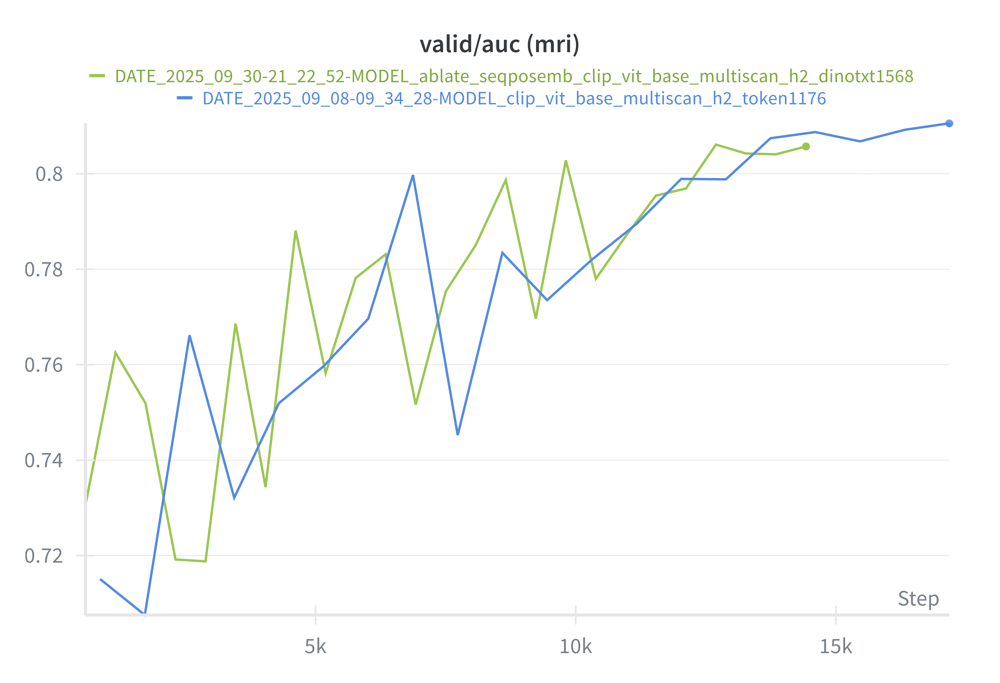
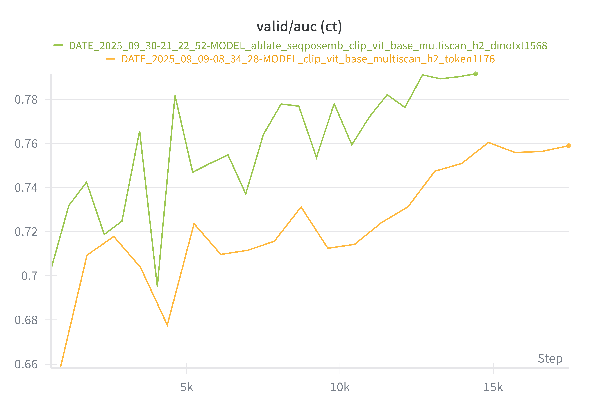

# HLIP Ablation Study

This page presents a comprehensive ablation study for **HLIP (Hierarchical Language-Image Pretraining)**, focusing on architectural design choices, training strategies, pretraining objectives, and multi-modal alignment.

All experiments were conducted on large-scale 3D MRI/CT datasets using the HLIP 2025 pipeline.

---

## 📌 1. Experimental Setup

- **Backbone**: Vision Transformer (ViT-L / ViT-H depending on experiment)
- **Text encoder**: GPT-4o-mini / GPT-4.1-mini variants
- **Pretraining data**: BrainMRI220K, CT-RATE, Pub-Brain-5
- **Tasks**: Zero-shot classification, VQA, report generation
- **Metrics**: Macro-AUC, Accuracy, BLEU/ROUGE for report generation  
- **Compute**: 8 × L40S + FSDP + FlashAttention 3

You can expand this section with dataset sizes, sampling strategies, and other details.

---

## 📌 2. Effect of MRI Pooling Strategy

.png)

**Summary:**  
Comparison of using `CLS token pooling` versus the `DINO-style pooled representation`.

- CLS token lacks 3D spatial stability  
- DINO pooling improves zero-shot classification  
- Helps downstream VQA due to smoother global context embedding

---

## 📌 3. Effect of MRI Patch Size

.png)

Key observation:

- Smaller spatial patch improves anatomical sensitivity  
- Improves subtle lesion detection  
- But increases memory usage

---

## 📌 4. MRI Patch Dropout

### (a) Low dropout → High dropout

.png)

### (b) Moderate dropout → Strong dropout

.png)

**Findings:**

- Moderate dropout improves robustness  
- Too much dropout harms volumetric consistency  

---

## 📌 5. Sequence Embedding (w/ vs. w/o)

.png)

**Summary:**  
Sequence positional embedding strongly impacts the model’s ability to align slice order and anatomical continuity.

---

## 📌 6. Effect of Multi-scan Sampling Count

.png)

- Fewer scans per study reduce memory footprint  
- But degrade performance on multi-lesion cases  

---

## 📌 7. CT vs MRI Unification Ablations

### (a) Sentence dropout (CT)

.png)

### (b) Sentence dropout (MRI)

.png)

### (c) Report-based dropout

 (ct).png)

Add any notes here about modality gap, multi-modal balancing, etc.

---

## 📌 8. Unmasked Finetuning

### (a) CT

.png)

### (b) MRI

.png)

---

## 📌 9. Cross-Modality Effects

### CT vs MRI  

### Joint training  

---

## 📌 10. Failed Experiments

This section documents design choices that **did not** improve performance but are useful for future work.

### (a) Rope for CT

.png)

### (b) Rope for MRI

.png)

### (c) MRI initialization (avg → central)

.png)

### (d) Patch size failure

.png)

---

## 📌 11. Impact of Report Model Choice

### (a) GPT-3.5-turbo → GPT-4.1-mini  
.png)

### (b) GPT-3.5-turbo → GPT-4-o-mini  
.png)

---

## 📌 12. Additional Notes / Future Directions

- Explore stronger hybrid ViT-CNN backbones  
- Use hierarchical RoPE for MRI slices  
- Balanced sampling for multi-study patients  
- 3D attention sparsification  
- Dynamic sequence selection based on metadata

---

## 📚 Citation

If you reference HLIP in academic work:

